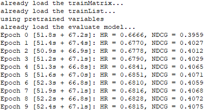
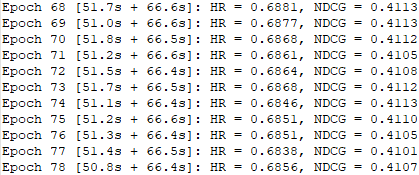
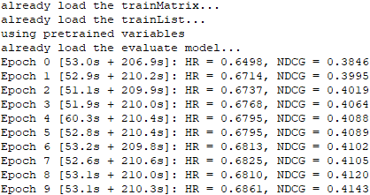
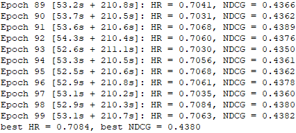

# DeepICF
TensorFlow Implementation of Deep Item-based Collaborative Filtering Model for Top-N Recommendation

This is the official implementation for the paper as follows, which is based on the implementation of [NAIS (TKDE2018)](https://github.com/AaronHeee/Neural-Attentive-Item-Similarity-Model):
- **DeepICF: Deep Item-based Collaborative Filtering Model for Top-N Recommendation.**
Feng Xue, Kai Liu, Xiang Wang, Jiandong Xu & Xiangnan He.

Two deep collaborative filtering models: **DeepICF** & **DeepICF+a**. To target the models for implicit feedback and ranking task, we optimize them using log loss with negative sampling.

**Please cite our paper if you use our codes. Thx!**

## Environment Settings
- Python: '2.7'
- TensorFlow: 'r1.0'
- Numpy: '1.13'

## Examples to run the codes
Run **DeepICF** (with FISM item embeddings pre-training):
```
python DeepICF.py --path Data/ --dataset ml-1m --epochs 100 --verbose 1 --batch_choice user --embed_size 16 --layers [64,32,16] --regs [1e-06,1e-06] --reg_W [0.1,0.1,0.1,0.1] --alpha 0.5 --train_loss 1 --num_neg 4 --lr 0.01 --batch_norm 1 --pretrain 1
```
Output of **DeepICF**: <\br>
<\br>
...<\br>
<\br>

Run **DeepICF+a** (with FISM item embeddings pre-training):
```
python DeepICF_a.py --path Data/ --dataset ml-1m --epochs 100 --beta 0.8 --weight_size 16 --activation 0 --algorithm 0 --verbose 1 --batch_choice user --embed_size 16 --layers [64,32,16] --regs [1e-06,1e-06,1e-06] --reg_W [10,10,10,10] --alpha 0 --train_loss 1 --num_neg 4 --lr 0.01 --batch_norm 1 --pretrain 1
```
Output of **DeepICF+a**:

...


## Datasets
We provide two processed datasets: MovieLens 1 Million (ml-1m) and Pinterest (pinterest-20).

**train.rating:**
- Train file.
- Each Line is a training instance: userID\t itemID\t rating\t timestamp (if have)

**test.rating:**
- Test file (positive instances).
- Each Line is a testing instance: userID\t itemID\t rating\t timestamp (if have)

**test.negative:**
- Test file (negative instances).
- Each line corresponds to the line of test.rating, containing 99 negative samples.
- Each line is in the format: (userID,itemID)\t negativeItemID1\t negativeItemID2 ...

Update Date: May 14th, 2018
